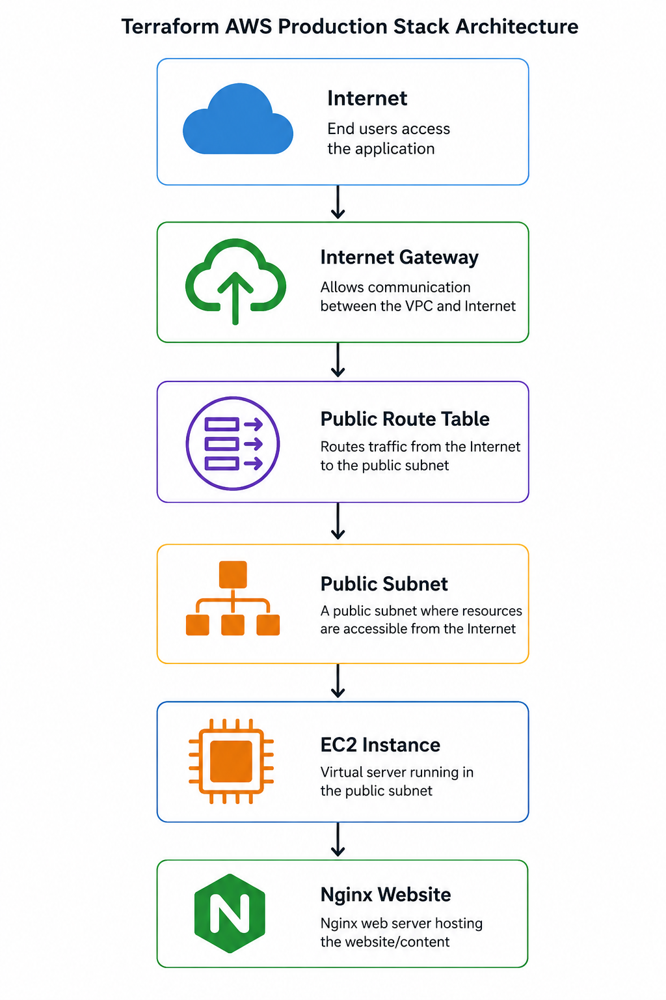
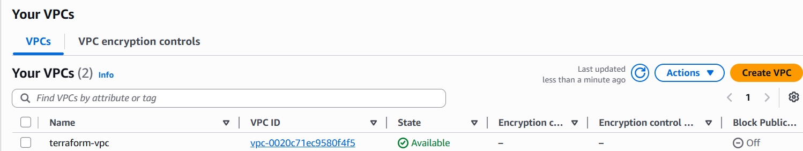
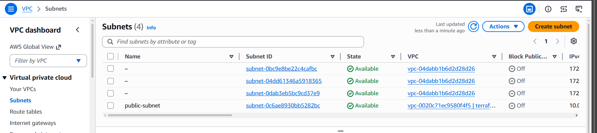
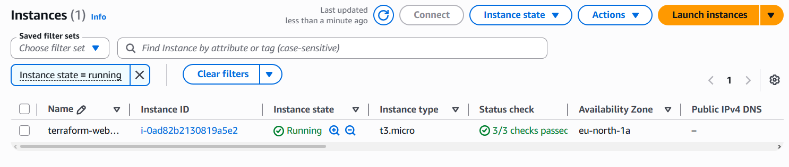
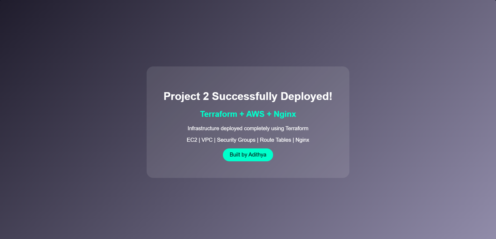

## 🚀 Overview

This project demonstrates deploying a production-style AWS infrastructure using Terraform Infrastructure as Code (IaC).

### Technologies Used

* Terraform
* AWS EC2
* AWS VPC
* Public Subnet
* Internet Gateway
* Route Tables
* Security Groups
* Nginx

### Features

* Custom VPC creation
* Public subnet configuration
* Internet connectivity through Internet Gateway
* Route table association
* Security Group rules for HTTP and SSH
* EC2 instance provisioning
* Automated Nginx installation using User Data
* Custom website deployment

# 📸 Project Screenshots

## Architecture Diagram

## AWS Networking Configuration

## Public Subnet Configuration

## EC2 Instance Running

## Deployed Website Preview

